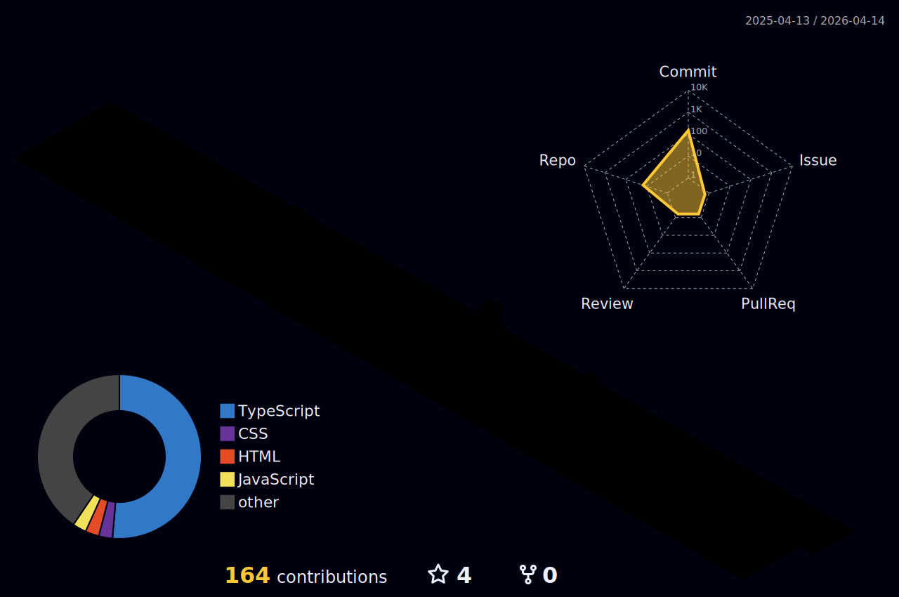

  

  

<h2> About Me</h2>

<ul>
  <li>🚀 <b>Full Stack Developer</b> passionate about building scalable, production-ready applications</li>
  <li>💡 Enthusiastic about <b>clean architecture</b> and <b>reusable component design</b></li>
  <li>🔧 Skilled in: <b>JavaScript</b>, <b>TypeScript</b>, <b>Python</b>, <b>PHP</b>, <b>Java</b></li>
  <li>🔍 Exploring <b>AI/ML</b>, <b>data visualization</b>, and <b>cloud deployment</b></li>
  <li>🧩 Fun fact: I enjoy solving complex problems and optimizing backend performance</li>
  <li>
    📄 View my 
    <a href="https://drive.google.com/file/d/1KLw8J_zy4SHtcUWBTTJOhe9ZdvAso-Ai/view?usp=sharing" target="_blank" style="text-decoration: none;">
      <b>Resume</b>
    </a>
  </li>
</ul>

<h2> Tech & Tools</h2>

<table align="center">
  <tr>
    <td align="center" width="90">
      
       JavaScript
    </td>
    <td align="center" width="90">
      
       TypeScript
    </td>
    <td align="center" width="90">
      
       Python
    </td>
    <td align="center" width="90">
      
       Java
    </td>
    <td align="center" width="90">
      
       PHP
    </td>
  </tr>
  <tr>
    <td align="center" width="90">
      
       React
    </td>
    <td align="center" width="90">
      
       Next.js
    </td>
    <td align="center" width="90">
      
       Node.js
    </td>
    <td align="center" width="90">
      
       NestJS
    </td>
    <td align="center" width="90">
      
       Express.js
    </td>
  </tr>
  <tr>
    <td align="center" width="90">
      
       Tailwind
    </td>
    <td align="center" width="90">
      
       MongoDB
    </td>
    <td align="center" width="90">
      
       MySQL
    </td>
    <td align="center" width="90">
      
       PostgreSQL
    </td>
    <td align="center" width="90">
      
       Firebase
    </td>
  </tr>
  <tr>
    <td align="center" width="90">
      
       Vercel
    </td>
    <td align="center" width="90">
      
       Docker
    </td>
    <td align="center" width="90">
      
       Postman
    </td>
    <td align="center" width="90">
      
       Git
    </td>
    <td align="center" width="90">
      
       Canva
    </td>
  </tr>
</table>

  <h2>
     
    GitHub Stats
  </h2>

<table align="center" style="border-collapse: collapse;">
  <tr>
    <td align="center" width="50%">
      
    </td>
    <td align="center" width="50%">
      
    </td>
  </tr>
  <tr>
    <td colspan="2" align="center">
      
    </td>
  </tr>
</table>

  <h2>
     
    Contributions
  </h2>

  <!-- 3D Contribution Graph -->
  

  <!-- Snake Contribution Animation -->
  

  <h2>
     
    Let's Connect
  </h2>
  

    
    &nbsp;&nbsp;
    
  

