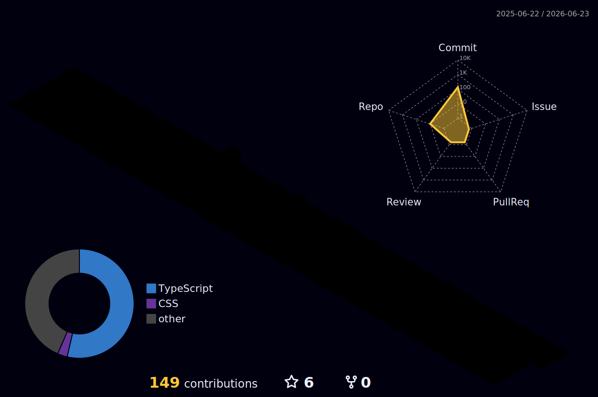
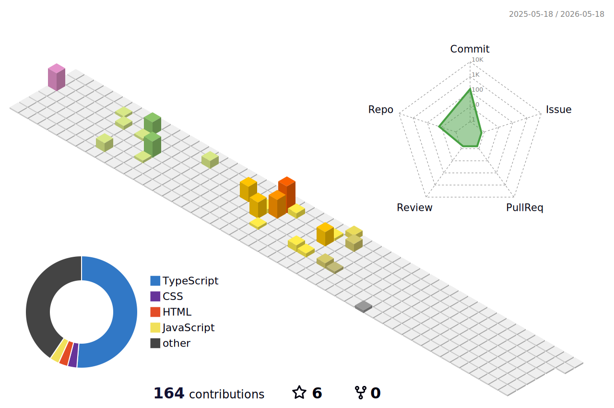
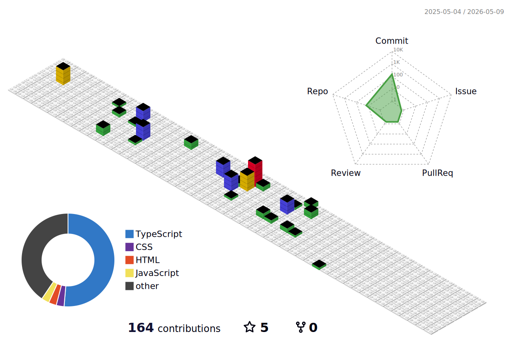
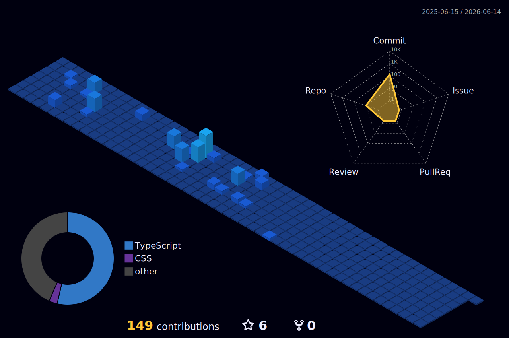

  

  
  
  
  

---

## About

Full-stack developer building production-grade applications end to end. I care about clean
architecture, reusable component design, and backend performance — the parts that decide
whether a codebase is still pleasant to work in six months later.

- Backend-leaning full-stack, strongest in **TypeScript / NestJS / PostgreSQL**
- Currently exploring AI/ML, data visualization, and cloud deployment
- Open to collaboration and interesting engineering problems

## Tech

<table align="center">
  <tr>
    <td align="center" width="90">
      
       JavaScript
    </td>
    <td align="center" width="90">
      
       TypeScript
    </td>
    <td align="center" width="90">
      
       Python
    </td>
    <td align="center" width="90">
      
       Java
    </td>
    <td align="center" width="90">
      
       PHP
    </td>
  </tr>
  <tr>
    <td align="center" width="90">
      
       React
    </td>
    <td align="center" width="90">
      
       Next.js
    </td>
    <td align="center" width="90">
      
       Node.js
    </td>
    <td align="center" width="90">
      
       NestJS
    </td>
    <td align="center" width="90">
      
       Express.js
    </td>
  </tr>
  <tr>
    <td align="center" width="90">
      
       Tailwind
    </td>
    <td align="center" width="90">
      
       MongoDB
    </td>
    <td align="center" width="90">
      
       MySQL
    </td>
    <td align="center" width="90">
      
       PostgreSQL
    </td>
    <td align="center" width="90">
      
       Firebase
    </td>
  </tr>
  <tr>
    <td align="center" width="90">
      
       Vercel
    </td>
    <td align="center" width="90">
      
       Docker
    </td>
    <td align="center" width="90">
      
       Postman
    </td>
    <td align="center" width="90">
      
       Git
    </td>
    <td align="center" width="90">
      
       Canva
    </td>
  </tr>
</table>

## Projects

Ordered by how much I've actually been committing lately — regenerated daily by
[`projects.yml`](.github/workflows/projects.yml), so the list reorders itself as work shifts.

<!-- PROJECTS:START -->

| Project | Description | Language | Commits | Stars |
| --- | --- | --- | --: | --: |
| **[nishit-shivdasani](https://github.com/nishit-shivdasani/nishit-shivdasani)** | — | — | 61 | — |
| **[custom-nestjs-automapper](https://github.com/nishit-shivdasani/custom-nestjs-automapper)** | A lightweight, type-safe object mapping library for TypeScript and NestJS — built for spe… | TypeScript | 32 | — |
| **[nestjs-postgres-docker-boilerplate](https://github.com/nishit-shivdasani/nestjs-postgres-docker-boilerplate)** | A robust, production-grade 🏭 NestJS starter packed with essential features 🔋—now upgrad… | TypeScript | 22 | ⭐ 1 |
| **[Nest-Mart-Shop-Frontend-React](https://github.com/nishit-shivdasani/Nest-Mart-Shop-Frontend-React)** | NestMart Shop is a modern and responsive frontend application built to manage products, c… | TypeScript | 12 | ⭐ 1 |
| **[Fusion-2048-Game](https://github.com/nishit-shivdasani/Fusion-2048-Game)** | A modern, browser-based version of the classic 2048 game with a sleek interface and smoot… | CSS | 4 | — |
| **[PWA_Demo](https://github.com/nishit-shivdasani/PWA_Demo)** | — | TypeScript | 2 | — |

Ranked by commits over the past year · updated 2026-07-22

<!-- PROJECTS:END -->

<a href="https://github.com/nishit-shivdasani?tab=repositories">See all repositories →</a>

## Collaborations

Most of my work happens alongside other people. Repositories I don't own but commit to —
regenerated by the same workflow, ranked by my own commits rather than the repo's size.

<!-- COLLABS:START -->

No public collaborations in the past year · updated 2026-07-22

<!-- COLLABS:END -->

## Private work

Most of what I build ships behind closed repos, so the tables above tell only part of the story.
Counted the same way by [`projects.yml`](.github/workflows/projects.yml) — volume and stack only.
Client and employer repositories stay unnamed by design.

<!-- PRIVATE:START -->

No private contributions to report · updated 2026-07-22

<!-- PRIVATE:END -->

## Activity

  

  

### Contributions in 3D

Regenerated nightly by [`3d-profile.yml`](.github/workflows/3d-profile.yml) — each block is a day of commits.

  

  
Other 3D renders

  

  

  

<picture>
  <source media="(prefers-color-scheme: dark)" srcset="./assets/github-contribution-grid-snake-dark.svg" />
  
</picture>

---

Built and maintained by <a href="https://github.com/nishit-shivdasani">@nishit-shivdasani</a>

